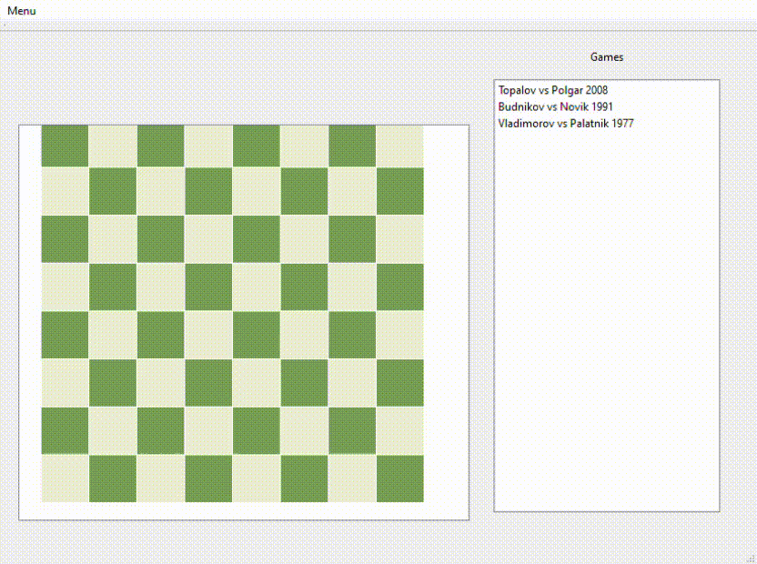

# Chess

  
  
  

---

## Overview

This Chess Project is a C++ application with a Qt-based graphical interface. It lets you play chess, showing valid moves for pieces and marking invalid ones in red. The project currently supports only the following chess pieces: bishop, king, and rook. You can play preconfigured games such as **Topalov vs Polgar (2008)**, **Budnikov vs Novik (1991)**, and **Vladimorov vs Palatnik (1977)**.

## Prerequisites

Ensure you have the following installed:

- **Qt Framework**: Version 6.x or above.
- **Visual Studio**: Version 2022 or later with C++ development tools.

## Project Setup

1. **Install Qt Framework**:

   - Download the Qt Installer from [Qt Downloads](https://www.qt.io/download).
   - Install Qt with components suitable for your system (e.g., MSVC for Windows).
2. **Open in Visual Studio**:

   - Launch Visual Studio.
   - Open the project folder.
   - Visual Studio will detect and configure the project automatically.
3. **Configure Qt in Visual Studio** (if needed):

   - Set up the Qt path in Visual Studio to ensure proper integration.
4. **Build the Project**:

   - Select the desired build configuration (`Debug` or `Release`).
   - Click `Build > Build All` to compile the application.

## Test the Code

- **Run Tests**:

  - To run tests, **launch the app in Debug mode**.
  - Test results will appear in the console window.
- **View Console Output in Visual Studio**:

  - Open the **Test Explorer** via `Test > Windows > Test Explorer`.
  - Right-click on a test and select **Debug** to run it in debug mode.
  - During debugging, console outputs will appear in the **Output** window under the **Debug** section.
  - To view outputs after running tests, select **Tests** in the "Show output from" drop-down list at the top of the **Output** window.

## Aperçu

Ce projet d'échecs est une application C++ avec une interface graphique basée sur Qt. Il permet de jouer aux échecs, en affichant les coups valides des pièces et en marquant ceux invalides en rouge. Le projet prend actuellement en charge uniquement les pièces suivantes : fou, roi et tour. Vous pouvez jouer à des parties préconfigurées telles que **Topalov contre Polgar (2008)**, **Budnikov contre Novik (1991)** et **Vladimorov contre Palatnik (1977)**.

      

## Prérequis

Assurez-vous d'avoir les éléments suivants installés :

- **Qt Framework** : Version 6.x ou supérieure.
- **Visual Studio** : Version 2022 ou ultérieure avec les outils de développement C++.

## Configuration du projet

1. **Installer Qt Framework** :

   - Téléchargez l'installateur Qt depuis [Qt Downloads](https://www.qt.io/download).
   - Installez Qt avec les composants adaptés à votre système (par exemple, MSVC pour Windows).
2. **Ouvrir dans Visual Studio** :

   - Lancez Visual Studio.
   - Ouvrez le dossier du projet.
   - Visual Studio détectera et configurera automatiquement le projet.
3. **Configurer Qt dans Visual Studio** (si nécessaire) :

   - Configurez le chemin Qt dans Visual Studio pour assurer une intégration correcte.
4. **Compiler le projet** :

   - Sélectionnez la configuration de build souhaitée (`Débogage` ou `Release`).
   - Cliquez sur `Build > Build All` pour compiler l'application.

## Tester le code

- **Exécuter les tests** :

  - Pour exécuter les tests, **lancez l'application en mode Debug**.
  - Les résultats des tests apparaîtront dans la fenêtre de la console.
- **Voir la sortie de la console dans Visual Studio** :

  - Ouvrez **Explorateur de tests** via `Test > Fenêtres > Explorateur de tests`.
  - Faites un clic droit sur un test et sélectionnez **Déboguer** pour l'exécuter en mode débogage.
  - Pendant le débogage, les sorties de la console apparaîtront dans la fenêtre **Sortie** sous la section **Débogage**.
  - Pour voir les sorties après l'exécution des tests, sélectionnez **Tests** dans le menu déroulant "Afficher la sortie de" en haut de la fenêtre **Sortie**.
